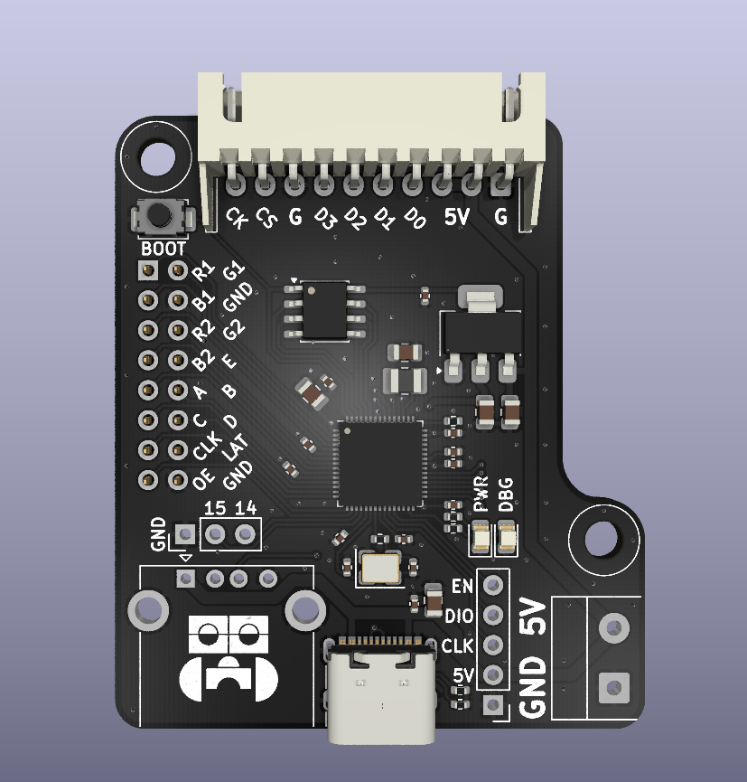
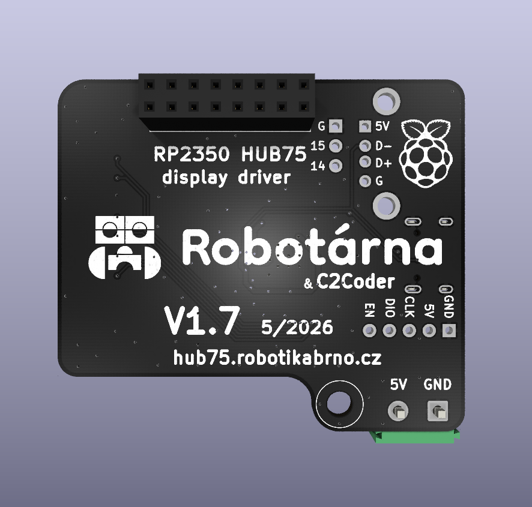

# RP2350 HUB75 Driver

Deska pro řízení HUB75 displejů založená na čipu [RP2350](https://www.raspberrypi.com/documentation/microcontrollers/silicon.html#rp2350)

    <figure>
        
        <figcaption>Front</figcaption>
    </figure>
    <figure>
        
        <figcaption>Back</figcaption>
    </figure>

## Pinout

### Displej

| RP2350 | Displej | Displej | RP2350 |
|---:|:---|---:|:---|
| IO0  | R1  | G1  | IO1  |
| IO2  | B1  | GND | GND  |
| IO3  | R2  | G2  | IO4  |
| IO5  | B2  | E   | IO6  |
| IO7  | A   | B   | IO8  |
| IO9  | C   | D   | IO10 |
| IO11 | CLK | LAT | IO12 |
| IO13 | OE  | GND | GND  |

### Konektor

!!! note
    Je možno použít QSPI nebo SPI, v tom případě musí být TX na MISO/RX pinu master desky!

| Konektor (pin) | Signál | RP2350 |
|---:|---|:---|
| 1  | GND | GND  |
| 2  | 5V  | 5V   |
| 3  | 5V  | 5V   |
| 4  | D0  | IO19 |
| 5  | D1  | IO20 |
| 6  | D2  | IO21 |
| 7  | D3  | IO22 |
| 8  | GND | GND  |
| 9  | CS  | IO23 |
| 10 | CK  | IO24 |

### Extra konektor
- Na desce jsou vyvedené 2 extra datové piny na kterých je přístupné I2C a UART pro další rozšíření. (není implementováno)

| Pin | I2C | UART |
|---:|---|---|
| 14  | SDA  | TX  |
| 15  | SCL  | RX  |

### DBG & PWR Led
- Debug/status led - IO18
- Power led - 3V3