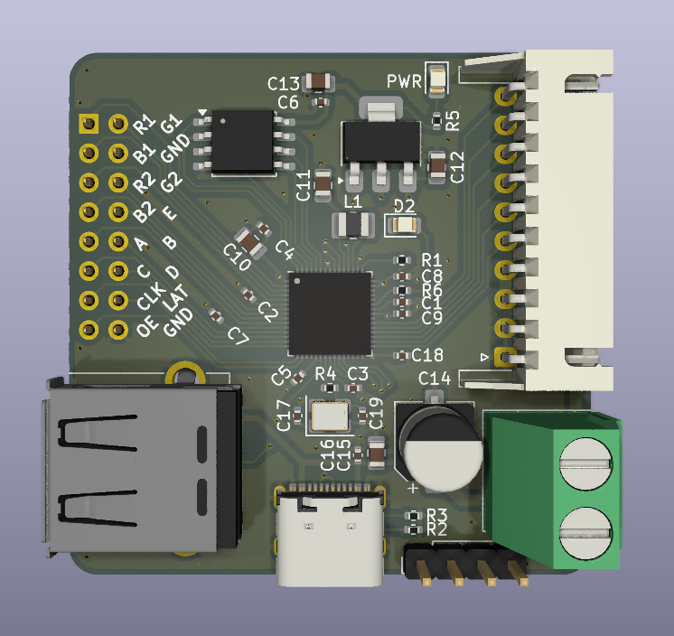
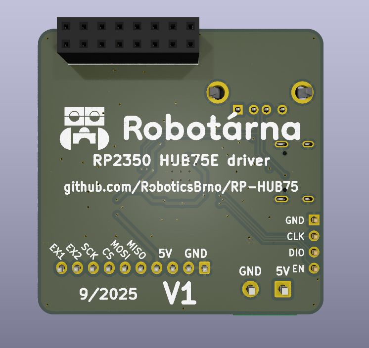

# RP2350 HUB75 Driver

Deska pro řízení HUB75 displejů založená na čipu [RP2350](https://www.raspberrypi.com/documentation/microcontrollers/silicon.html#rp2350)

<div style="display:grid; grid-template-columns:repeat(auto-fit,minmax(160px,1fr)); gap:1rem; align-items:start;">
    <figure>
        
        <figcaption>Front</figcaption>
    </figure>
    <figure>
        
        <figcaption>Back</figcaption>
    </figure>
</div>

## Pinout

### Displej

| RP2350 | Displej | Displej | RP2350 |
|---:|:---|---:|:---|
| IO0  | R1  | G1  | IO1   |
| IO2  | B1  | GND | GND   |
| IO3  | R2  | G2  | IO4   |
| IO5  | B2  | E   | IO6   |
| IO7  | A   | B   | IO8   |
| IO9  | C   | D   | IO10  |
| IO11 | CLK | LAT | IO12  |
| IO13 | OE  | GND | GND   |


### Konektor

```
Tato deska je **SPI SLAVE**, proto je MISO na TX pinu RP2350
```

| Konektor (pin) | Signál | RP2350 |
|---:|---|:---|
| 1  | 5V   | 5V   |
| 2  | 5V   | 5V   |
| 3  | GND  | GND  |
| 4  | GND  | GND  |
| 5  | MISO | IO19 |
| 6  | MOSI | IO20 |
| 7  | CS   | IO21 |
| 8  | SCK  | IO22 |
| 9  | X1   | IO23 |
| 10 | X2   | IO24 |